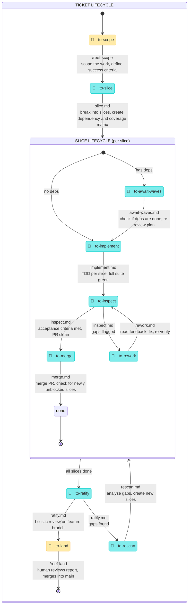

<p align="center">
  
</p>

# Moonjelly Reef

An orchestration framework for AI agent workflows. A short-lived pulse scans for work, dispatches skills, and goes back to sleep. State lives in tags. The reef does the rest.

This framework is **Issue tracker agnostic**. GitHub Issues, Jira, ClickUp, Linear, any kanban board or simply local MD files. Use yours.

## Install

```sh
npx skills@latest add mesqueeb/moonjelly-reef
```

On first run, reef-pulse will prompt you to configure your issue tracker and install optional dependencies (`tdd`, `ubiquitous-language`).

## 🪼 The moonjelly pulse

> _Through Moonjelly's pulse, the reef is orchestrated, creatures are set in motion, and Moonjelly recedes._

The moonjelly is the orchestrator. A short-lived session (cron or manual) that scans tags, dispatches skills, and exits. It holds no state — tags are the state. Each pulse: scan → dispatch → exit.

## State machine

> 🤿 = human (the diver)
> 🌊 = automated (the reef)



> While slices are being worked, the parent ticket sits in `in-progress`. It is promoted to `to-ratify` once all slices are done.

## Phase details

<details>
<summary>🪼 orchestrator · <code>/reef-pulse</code>
· 🤿/🌊</summary>

> _Through Moonjelly's pulse, the reef is orchestrated, creatures are set in motion, and Moonjelly recedes._

**Input**: none. You are the orchestrator. Run with `--hitl` (manual, includes human phases) or `--afk` (cron, bot phases only).

Each pulse:

```
1. Scan all items by tag (issue tracker or local md files).

2. Dispatch all 🌊 work as sub-agents (in parallel):
   ├─ to-slice            → break into slices, create dependency and coverage matrix
   ├─ to-await-waves     → check if deps are done, re-review plan
   ├─ to-implement        → TDD per slice, full suite green
   ├─ to-rework           → read feedback, fix, re-verify
   ├─ to-inspect          → inspect the PR
   ├─ to-merge            → merge PR, check for newly unblocked slices
   ├─ to-ratify           → holistic review on feature branch
   └─ to-rescan           → analyze gaps, create new slices

   Parallel slices within the same parent may be dispatched as an agent team
   (shared task list, self-claim, direct messaging) when beneficial.

   Each phase tags its own work when done (next phase tag).

3. If running with --hitl, present 🤿 items to the human:
   ├─ to-scope    → scope the work, define success criteria
   └─ to-land       → human reviews report, merges into main

   If running with --afk, skip step 3 entirely (bot phases only).

4. Exit when nothing is actionable.
```

When running as a cron (`--afk`): wake → dispatch bot work → sleep.
When running manually (`--hitl`): dispatch bot work + present human items → repeat until nothing actionable.

State lives in tags (issue tracker tags or filename prefixes), not in session memory. Skills read tags, do their work, and set the next tag. The pulse itself holds no state — it just scans and dispatches.

Design principles:

- **Testing at source**: each transition includes verification before tagging. No separate "testing" states.
- **Small batches**: slices flow through the pipeline independently and concurrently. The pulse doesn't wait for all slices to reach the same state.
- **Human = bottleneck**: minimize 🤿 states. Only two: scope, land.
- **No heroics**: agents that are stuck flag + move on, never spiral.
- **Make work visible**: the tags ARE the visibility. Scan tags = see the whole board.

</details>

<details>
<summary>🏷️ <code>to-scope</code> · <code>/reef-scope</code> · 🤿</summary>

> _Moonjelly bumps the diver's mask and points into the dark. Together they scope what lies ahead — the moonjelly illuminates, the diver makes sense of it._

**Input**: a work item tagged `to-scope`.

You will scope the work with the user. Determine whether this is a feature, refactor, or bug, and pick the appropriate approach.

You are responsible for:

- For features without a decision record: running the interview inline to reach shared understanding
- For features with a decision record: consuming the existing decisions
- Grilling on **success criteria** if not already covered: what does "done" look like from the consumer's perspective? Each criterion must be mechanically verifiable.
- For features: producing a plan with phased vertical slices and durable architectural decisions
- For refactors: enforcing always-compiles, always-green, tiny-commit discipline in the plan
- For bugs: assessing scope (quick fix → single slice, elaborate → full plan)

When the scope is complete:

1. Write the plan with a **Success Criteria** section.
2. Every decision from the decision record must map to ≥1 success criterion. If any are missing, add them.
3. Tag the item `to-slice`.

| Output        |                                                                                                    |
| ------------- | -------------------------------------------------------------------------------------------------- |
| Issue tracker | Plan + success criteria **prepended** to issue body (decision record stays below). Tag `to-slice`. |
| Local files   | Plan + success criteria prepended in `{title}/[to-slice] plan.md` (decision record stays below).   |

</details>

<details>
<summary>🏷️ <code>to-slice</code> · <code>reef-pulse/slice.md</code> · 🌊</summary>

> _A mantis shrimp shatters a crab shell into clean, separate pieces with a single devastating strike — each fragment deliberate, each piece ready to carry off._

**Input**: a work item tagged `to-slice` with a plan and success criteria.

Break the plan into vertical slices. Each slice is a thin end-to-end cut through all layers, not a horizontal slice of one layer. Every success criterion must be covered by ≥1 slice acceptance criterion. If gaps remain after drafting, revise slices until covered.

1. Read the plan and success criteria.
2. Create a **feature branch** (branched from main or the configured base). All slice PRs will target this branch.
3. Draft slices as sub-issues, each with:
   - Acceptance criteria
   - `blocked-by` references (explicit dependency graph)
4. Build a **coverage matrix**: each success criterion → which slice(s) → which acceptance criterion/criteria.
5. Verify: every criterion is covered. If not, add slices until covered.
6. Tag unblocked slices `to-implement`. Tag blocked slices `to-await-waves`.

For small bugs (scope = quick fix): produce a single slice. The triage acceptance criteria are the slice's acceptance criteria. No coverage matrix needed.

| Output        |                                                                                                                                                                                              |
| ------------- | -------------------------------------------------------------------------------------------------------------------------------------------------------------------------------------------- |
| Issue tracker | Sub-issues with acceptance criteria + dependency graph. **Coverage matrix** appended to parent issue body. Feature branch created. Each sub-issue tagged `to-implement` or `to-await-waves`. |
| Local files   | `{title}/slices/[to-implement] 001-slice-name.md`. Coverage matrix appended to `{title}/[...] plan.md`. Feature branch created.                                                              |

</details>

<details>
<summary>🏷️ <code>to-await-waves</code> · <code>reef-pulse/await-waves.md</code> · 🌊</summary>

> _A surfer sits on the board beyond the break, watching the horizon, patient and still — when the waves come, they're ready._

**Input**: a slice tagged `to-await-waves` with a `blocked-by` list.

Check whether this slice's dependencies have all been merged. If not, exit — you'll be called again next pulse.

1. Fetch latest remote.
2. Check: are all dependency slices tagged `done` with PRs merged?
   - If no → exit. Do nothing. This slice stays `to-await-waves`.
   - If yes → continue.
3. Re-review this slice's plan against the current state of the feature branch. Earlier slices may have changed the codebase in ways that affect this slice's approach (new interfaces, renamed modules, shifted boundaries).
4. If the plan still holds → tag `to-implement`.
5. If adjustments needed → update the slice's acceptance criteria/description to reflect the current reality, then tag `to-implement`.

| Output        |                                                                                                                |
| ------------- | -------------------------------------------------------------------------------------------------------------- |
| Issue tracker | Slice tagged `to-implement` (possibly with updated acceptance criteria). Or no change if deps aren't done yet. |
| Local files   | Slice md file updated if needed. Or no change.                                                                 |

</details>

<details>
<summary>🏷️ <code>to-implement</code> · <code>reef-pulse/implement.md</code> · 🌊</summary>

> _Eight arms working in fierce, silent concert, the octopus reshapes the reef floor — architecting, testing, sealing every chamber with cold intelligence._

**Input**: a slice tagged `to-implement` with acceptance criteria and a parent work item.

Implement this slice using TDD. This is your non-negotiable contract:

```
1. GIT PREP
   □ Create worktree from {base-commit} on branch {slice-branch}
   □ Verify remote is pulled
   □ Verify base branch has all previously merged slices
   □ Verify no unrelated commits present

2. READ CONTEXT
   □ This slice's acceptance criteria (the checklist to satisfy)
   □ Parent plan + success criteria (the "why")
   □ Sibling slices (awareness of what others are doing / have done)
   □ The decision record (the original decisions)

3. TDD LOOP
   □ For each acceptance criterion: write test → implement → verify
   □ Full project test suite must be green (not a subset)
   □ If stuck: make best judgment, document the choice, continue
   □ Never silently skip an acceptance criterion

4. REPORT (in PR description)
   □ acceptance criteria checklist: each one done ✓ or not ✗ with explanation
   □ Ambiguous choices: what was decided, why, how it differs from acceptance criteria
   □ Test results: full suite output
   □ Any drift from success criteria
```

When done, open a PR targeting the feature branch. Tag slice `to-inspect`.

| Output        |                                                                                                    |
| ------------- | -------------------------------------------------------------------------------------------------- |
| Issue tracker | PR targeting feature branch. PR description follows report template above. Tag slice `to-inspect`. |
| Local files   | same (PR is always git-based).                                                                     |

</details>

<details>
<summary>🏷️ <code>to-inspect</code> · <code>reef-pulse/inspect.md</code> · 🌊</summary>

> _A barreleye fish rotates its tubular eyes upward through its transparent skull, scrutinizing every shadow above for anything that doesn't belong._

**Input**: a slice tagged `to-inspect` with an open PR.

You are independently verifying this PR. Do not trust the implementer's self-report — verify everything yourself.

1. Pull latest remote. Checkout the PR branch.
2. Run the full project test suite.
3. Check each acceptance criterion against the actual code. For every acceptance criterion, confirm it is met by reading the implementation, not by reading the PR description.
4. Read the "ambiguous choices" section — flag anything that drifted too far from the success criteria.
5. Trivial cleanups (dead code, stale comments, formatting): do them yourself and commit.
6. Substantive gaps: document clearly in PR review comments.

If all acceptance criteria are met and the suite is green → tag slice `to-merge`.
If gaps are found → tag slice `to-rework` with specific feedback in PR review comments.

| Output                      |                                                                     |
| --------------------------- | ------------------------------------------------------------------- |
| All acceptance criteria met | Tag slice `to-merge`.                                               |
| Gaps found                  | Tag slice `to-rework` with specific feedback in PR review comments. |

</details>

<details>
<summary>🏷️ <code>to-rework</code> · <code>reef-pulse/rework.md</code> · 🌊</summary>

> _A hermit crab drags its soft abdomen out of an ill-fitting shell and squeezes into a better one — uncomfortable work, exposed and vulnerable, but necessary._

**Input**: a slice tagged `to-rework` with review feedback on the PR.

Fix the issues flagged by the inspector.

1. Read all review feedback (PR comments).
2. Read the original acceptance criteria + any new acceptance criteria the inspector added.
3. Fix the flagged items. Address every comment — don't skip any.
4. Run the full project test suite.
5. Update the PR description with a revised report (same template as `implement.md`).
6. Tag slice `to-inspect`.

| Output        |                                                |
| ------------- | ---------------------------------------------- |
| Issue tracker | Updated PR with fixes. Tag slice `to-inspect`. |
| Local files   | same.                                          |

</details>

<details>
<summary>🏷️ <code>to-merge</code> · <code>reef-pulse/merge.md</code> · 🌊</summary>

> _The great manta ray glides in wide and smooth, gathers the loose piece in a gentle sweep of its wings, and folds it seamlessly into the whole flowing current._

**Input**: a slice tagged `to-merge` with an approved PR.

Merge this PR into the feature branch and update the board.

1. Verify feature branch is up to date with remote.
2. Merge PR (squash or regular per project convention).
3. Verify full suite still green after merge.
4. Close the slice issue. Tag slice `done`.
5. Check: did this merge unblock any sibling slices? If yes → tag those siblings `to-await-waves` (so next pulse re-reviews and promotes them).
6. Check: are ALL slices for the parent work item now `done`? If yes → tag parent `to-ratify`.

| Output        |                                                                          |
| ------------- | ------------------------------------------------------------------------ |
| Issue tracker | Merged PR. Slice tagged `done`. Parent → `to-ratify` if all slices done. |
| Local files   | same.                                                                    |

</details>

<details>
<summary>🏷️ <code>to-ratify</code> · <code>reef-pulse/ratify.md</code> · 🌊</summary>

> _The walrus hauls itself onto the ice floe, surveys the entire colony with slow, deliberate eyes, and counts every last pup — nothing is declared safe until the old bull has seen it all._

**Input**: a work item tagged `to-ratify` with all slices merged to the feature branch.

Run a holistic review of the entire feature branch. You are checking the whole, not the parts.

1. Pull latest remote. Checkout the feature branch.
2. Check every success criterion against the actual code holistically (not per-slice — the whole must hold together).
3. Run the full project test suite.
4. If all criteria met → generate the **aggregate report** → tag parent `to-land`.
5. If gaps found → tag parent `to-rescan`.

The aggregate report contains:

- Success criteria: all met ✓/✗
- Coverage matrix: final status
- All ambiguous LLM decisions (aggregated from every sub-agent's PR descriptions)
- Any drift from the original decision record
- Ticket lifecycle: all closed cleanly?

| Output               |                                                                   |
| -------------------- | ----------------------------------------------------------------- |
| Issue tracker (pass) | Final report on feature branch → main PR. Tag parent `to-land`.   |
| Issue tracker (gaps) | Tag parent `to-rescan`.                                           |
| Local files (pass)   | Final report on feature branch → main PR. Tag parent `[to-land]`. |
| Local files (gaps)   | Tag parent `[to-rescan]`.                                         |

</details>

<details>
<summary>🏷️ <code>to-rescan</code> · <code>reef-pulse/rescan.md</code> · 🌊</summary>

> _An anglerfish drifts through absolute darkness, its lure casting light on creatures no one knew were lurking in the deep._

**Input**: a work item tagged `to-rescan` after the ratify phase found gaps.

Analyze the gaps and create new slices for the remaining work. Do not ask a human — if the gaps need decisions that aren't in the success criteria, that's a failure of the planning phase. The whole point is that success criteria are complete enough to be self-service.

1. Read the ratify report to understand what gaps were found.
2. Read the success criteria and coverage matrix.
3. For each gap: create a new slice with acceptance criteria that explicitly address the gap.
   - If the gap is "an agent chose to skip something" (pain point C1), the new slice's acceptance criteria must call out what was skipped and why it matters.
4. Update the **coverage matrix** — every gap must now map to an acceptance criterion on a new slice.
5. Close partial original slices with a reference to the new slices.
6. Tag new slices `to-implement` or `to-await-waves` depending on dependencies.

| Output        |                                                                                                                                                                                                                      |
| ------------- | -------------------------------------------------------------------------------------------------------------------------------------------------------------------------------------------------------------------- |
| Issue tracker | New sub-issues linked to parent. Closes partial originals with reference to new issues. Tag new slices `to-implement` or `to-await-waves`. Coverage matrix updated on parent issue. Plan sections updated if needed. |
| Local files   | New slice files in `{title}/slices/`. Coverage matrix and plan updated in `{title}/[...] plan.md`.                                                                                                                   |

</details>

<details>
<summary>🏷️ <code>to-land</code> · <code>/reef-land</code> · 🤿</summary>

> _Moonjelly drifts to the diver one last time, the reef's work cradled in its bell. The diver returns to shore with what the reef has made._

**Input**: a work item tagged `to-land` with an aggregate report.

Present the aggregate report to the human. The report contains: success criteria status, coverage matrix, all LLM decisions/ambiguities, any drift from the decision record.

The human reviews and either:

- **Approves** → merge the feature branch into main. Close the work item. Done.
- **Requests changes (needs new decisions)** → tag `to-scope` for a new scoping session.
- **Requests changes (acceptance criteria are clear)** → tag `to-rescan` to create slices for remaining work.

</details>

## Git hygiene

Every agent works in its own git worktree — the main checkout is never touched. A feature branch is created from the base branch; all slice PRs target it. Implementation worktrees persist until their PR is merged; temporary worktrees (review, inspection) are torn down immediately. Only the merge phase removes worktrees and branches. Every git operation begins with `git fetch origin --prune`. No `--force` flags, ever. Before merging a slice, the branch is verified current with the feature branch; after merging, the feature branch suite must be green.

## Skill index

Three user-facing skills, everything else lives under `reef-pulse/`:

| 🏷️ Tag           | Skill / File                | Actor   | Lore                                                                                                             |
| ---------------- | --------------------------- | ------- | ---------------------------------------------------------------------------------------------------------------- |
| `to-scope`       | `/reef-scope`               | 🤿      | 🪼 Moonjelly bumps the diver's mask and points into the dark. Together they scope what lies ahead.               |
| —                | `/reef-pulse`               | 🤿 / 🌊 | 🪼 Through Moonjelly's pulse, the reef is orchestrated, creatures are set in motion, and Moonjelly recedes.      |
| `to-slice`       | `reef-pulse/slice.md`       | 🌊      | 🦐 A mantis shrimp shatters the shell into clean, separate pieces with a single strike.                          |
| `to-await-waves` | `reef-pulse/await-waves.md` | 🌊      | 🏄 A surfer sits beyond the break, watching the horizon — when the waves come, they're ready.                    |
| `to-implement`   | `reef-pulse/implement.md`   | 🌊      | 🐙 Eight arms in silent concert, the octopus reshapes the reef floor chamber by chamber.                         |
| `to-inspect`     | `reef-pulse/inspect.md`     | 🌊      | 👁 A barreleye rotates its tubular eyes through its transparent skull, scrutinizing every shadow.                |
| `to-rework`      | `reef-pulse/rework.md`      | 🌊      | 🐚 A hermit crab squeezes out of an ill-fitting shell and into a better one.                                     |
| `to-merge`       | `reef-pulse/merge.md`       | 🌊      | 🦈 A manta ray glides in wide, gathers the loose piece, and folds it into the current.                           |
| `to-ratify`      | `reef-pulse/ratify.md`      | 🌊      | 🦭 The walrus hauls onto the ice floe and counts every last pup — nothing is safe until he's seen it all.        |
| `to-rescan`      | `reef-pulse/rescan.md`      | 🌊      | 🐡 An anglerfish casts its lure into absolute darkness, illuminating creatures no one knew were there.           |
| `to-land`        | `/reef-land`                | 🤿      | 🪼 Moonjelly drifts to the diver one last time, the reef's work cradled in its bell. The diver returns to shore. |

## Companion skill

```sh
npx skills@latest add mesqueeb/moonjelly-reef/git-guardrails-claude-code
# Then run it once via
/git-guardrails-claude-code
```

Blocks dangerous git commands (force push, hard reset, force delete) while allowing safe everyday operations. Recommended for any project using reef.
