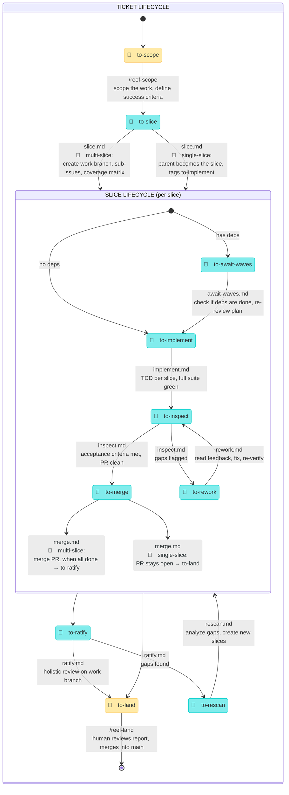

<p align="center">
  
</p>

# Moonjelly Reef

An orchestration framework for AI agent workflows. A short-lived pulse scans for work, dispatches skills, and goes back to sleep. State lives in tags. The reef does the rest.

This framework is **Issue tracker agnostic**. GitHub Issues, Jira, ClickUp, Linear, any kanban board or simply local MD files. Use yours.

## Install

```sh
npx skills@latest add mesqueeb/moonjelly-reef
```

On first run, reef-pulse will prompt you to configure your issue tracker and install optional dependencies (`tdd`, `ubiquitous-language`).

## 🪼 The moonjelly pulse

> _Through Moonjelly's pulse, the reef is orchestrated, creatures are set in motion, and Moonjelly recedes._

The moonjelly is the orchestrator. A short-lived session (cron or manual) that scans tags, dispatches skills, and exits. It holds no state — tags are the state. Each pulse: scan → dispatch → exit.

## State machine

> 🤿 = human (the diver)
> 🌊 = automated (the reef)



> While slices are being worked, the parent ticket sits in `in-progress`. It is promoted to `to-ratify` by `merge.md` once all slices are done.

## Skills

<details>
<summary>🤿 <code>/reef-scope</code> — scope a work item with the diver</summary>

> _Moonjelly bumps the diver's mask and points into the dark. Together they scope what lies ahead — the moonjelly illuminates, the diver makes sense of it._

The single entry point for turning ideas into plans. Determines whether the work is a feature, refactor, or bug, interviews the diver if needed, writes a plan with **success criteria**, and tags `to-slice`.

📄 [`reef-scope/SKILL.md`](reef-scope/SKILL.md)

</details>

<details>
<summary>🪼 <code>/reef-pulse</code> — the orchestrator</summary>

> _Through Moonjelly's pulse, the reef is orchestrated, creatures are set in motion, and Moonjelly recedes._

Scans all tagged work items, dispatches the appropriate phase for each as a sub-agent, and exits. Holds no state — tags are the state. Run with `--hitl` (manual, includes 🤿 items) or `--afk` (cron, 🌊 only).

Design principles:

- **Testing at source**: each transition includes verification before tagging.
- **Small batches**: slices flow independently and concurrently.
- **Human = bottleneck**: minimize 🤿 states. Only two: scope, land.
- **No heroics**: agents that are stuck flag + move on, never spiral.
- **Make work visible**: the tags ARE the visibility.

📄 [`reef-pulse/SKILL.md`](reef-pulse/SKILL.md)

</details>

<details>
<summary>🤿 <code>/reef-land</code> — the diver reviews and lands the work</summary>

> _Moonjelly drifts to the diver one last time, the reef's work cradled in its bell. The diver returns to shore with what the reef has made._

Finds the open PR for the work item and presents it to the diver. The diver approves (merge + close), requests re-scoping, or sends it back for new slices.

📄 [`reef-land/SKILL.md`](reef-land/SKILL.md)

</details>

## Pulse phase details

These are the 🌊 automated phases dispatched by `/reef-pulse`. Each phase reads its instructions from a file under `reef-pulse/`.

<details>
<summary>🏷️ <code>to-slice</code> · <code>reef-pulse/slice.md</code></summary>

> _A mantis shrimp shatters a crab shell into clean, separate pieces with a single devastating strike — each fragment deliberate, each piece ready to carry off._

Break the plan into vertical slices. 🔶 **Single-slice**: parent becomes the slice, tags `to-implement`, no work branch. 🔷 **Multi-slice**: create work branch, sub-issues, coverage matrix, tag slices `to-implement` or `to-await-waves`.

📄 [`reef-pulse/slice.md`](reef-pulse/slice.md)

</details>

<details>
<summary>🏷️ <code>to-await-waves</code> · <code>reef-pulse/await-waves.md</code></summary>

> _A surfer sits on the board beyond the break, watching the horizon, patient and still — when the waves come, they're ready._

Check if a blocked slice's dependencies are all done. If yes, re-review the plan against current code and tag `to-implement`. If not, exit — next pulse will check again.

📄 [`reef-pulse/await-waves.md`](reef-pulse/await-waves.md)

</details>

<details>
<summary>🏷️ <code>to-implement</code> · <code>reef-pulse/implement.md</code></summary>

> _Eight arms working in fierce, silent concert, the octopus reshapes the reef floor — architecting, testing, sealing every chamber with cold intelligence._

Implement a slice using TDD in a git worktree. Create worktree → read context → red-green-refactor for each acceptance criterion → write report → open PR → tag `to-inspect`.

📄 [`reef-pulse/implement.md`](reef-pulse/implement.md)

</details>

<details>
<summary>🏷️ <code>to-inspect</code> · <code>reef-pulse/inspect.md</code></summary>

> _A barreleye fish rotates its tubular eyes upward through its transparent skull, scrutinizing every shadow above for anything that doesn't belong._

Independently verify a slice PR. Run the full test suite, check each acceptance criterion against actual code, do trivial cleanups. Tag `to-merge` if approved, `to-rework` if gaps found.

📄 [`reef-pulse/inspect.md`](reef-pulse/inspect.md)

</details>

<details>
<summary>🏷️ <code>to-rework</code> · <code>reef-pulse/rework.md</code></summary>

> _A hermit crab drags its soft abdomen out of an ill-fitting shell and squeezes into a better one — uncomfortable work, exposed and vulnerable, but necessary._

Fix every issue flagged by the inspector. Address all PR comments, run the full suite, update the report, tag `to-inspect` for re-review.

📄 [`reef-pulse/rework.md`](reef-pulse/rework.md)

</details>

<details>
<summary>🏷️ <code>to-merge</code> · <code>reef-pulse/merge.md</code></summary>

> _The great manta ray glides in wide and smooth, gathers the loose piece in a gentle sweep of its wings, and folds it seamlessly into the whole flowing current._

🔶 **Single-slice**: leave the PR open for the diver, tag `to-land`. 🔷 **Multi-slice**: merge the PR into the work branch, verify suite, close the slice, check for newly unblocked siblings, tag parent `to-ratify` when all slices are done.

📄 [`reef-pulse/merge.md`](reef-pulse/merge.md)

</details>

<details>
<summary>🏷️ <code>to-ratify</code> · <code>reef-pulse/ratify.md</code></summary>

> _The walrus hauls itself onto the ice floe, surveys the entire colony with slow, deliberate eyes, and counts every last pup — nothing is declared safe until the old bull has seen it all._

🔷 Multi-slice only. Holistic review of the entire work branch — checking the composed whole, not the parts. Verify every success criterion end-to-end, run the full suite, produce the aggregate report, tag `to-land` or `to-rescan`.

📄 [`reef-pulse/ratify.md`](reef-pulse/ratify.md)

</details>

<details>
<summary>🏷️ <code>to-rescan</code> · <code>reef-pulse/rescan.md</code></summary>

> _An anglerfish drifts through absolute darkness, its lure casting light on creatures no one knew were lurking in the deep._

Analyze gaps found by ratify, re-review the entire plan, create new slices to address each gap, update the coverage matrix. The reef picks up the new slices on the next pulse.

📄 [`reef-pulse/rescan.md`](reef-pulse/rescan.md)

</details>

## Git hygiene

Every agent works in its own git worktree — the main checkout is never touched. For multi-slice work, a work branch is created from the base branch; slice PRs target it. For single-slice work, the PR targets the base branch directly — no work branch needed. Implementation worktrees persist until their PR is merged; temporary worktrees (review, inspection) are torn down immediately. Only the merge phase removes worktrees and branches. Every git operation begins with `git fetch origin --prune`. No `--force` flags, ever.

## Autopilot

Run the reef on autopilot so it pulses while you're away. In any Claude Code session:

```
/reef-pulse --afk
```

This runs a single AFK pulse (automated work only, no human prompts). To make it recurring, create a durable cron:

```
CronCreate cron="7 * * * *" prompt="/reef-pulse --afk" durable=true
```

This persists to `.claude/scheduled_tasks.json` and survives session restarts. It runs locally, so your git and GitHub credentials just work. Adjust the cron expression to your preferred interval (e.g. `"*/30 * * * *"` for every 30 minutes).

## Index

Three user-facing skills, everything else lives under `reef-pulse/`:

| 🏷️ Tag           | Skill / File                | Actor   | Lore                                                                                                             |
| ---------------- | --------------------------- | ------- | ---------------------------------------------------------------------------------------------------------------- |
| `to-scope`       | `/reef-scope`               | 🤿      | 🪼 Moonjelly bumps the diver's mask and points into the dark. Together they scope what lies ahead.               |
| —                | `/reef-pulse`               | 🤿 / 🌊 | 🪼 Through Moonjelly's pulse, the reef is orchestrated, creatures are set in motion, and Moonjelly recedes.      |
| `to-slice`       | `reef-pulse/slice.md`       | 🌊      | 🦐 A mantis shrimp shatters the shell into clean, separate pieces with a single strike.                          |
| `to-await-waves` | `reef-pulse/await-waves.md` | 🌊      | 🏄 A surfer sits beyond the break, watching the horizon — when the waves come, they're ready.                    |
| `to-implement`   | `reef-pulse/implement.md`   | 🌊      | 🐙 Eight arms in silent concert, the octopus reshapes the reef floor chamber by chamber.                         |
| `to-inspect`     | `reef-pulse/inspect.md`     | 🌊      | 👁 A barreleye rotates its tubular eyes through its transparent skull, scrutinizing every shadow.                |
| `to-rework`      | `reef-pulse/rework.md`      | 🌊      | 🐚 A hermit crab squeezes out of an ill-fitting shell and into a better one.                                     |
| `to-merge`       | `reef-pulse/merge.md`       | 🌊      | 🦈 A manta ray glides in wide, gathers the loose piece, and folds it into the current.                           |
| `to-ratify`      | `reef-pulse/ratify.md`      | 🌊      | 🦭 The walrus hauls onto the ice floe and counts every last pup — nothing is safe until he's seen it all.        |
| `to-rescan`      | `reef-pulse/rescan.md`      | 🌊      | 🐡 An anglerfish casts its lure into absolute darkness, illuminating creatures no one knew were there.           |
| `to-land`        | `/reef-land`                | 🤿      | 🪼 Moonjelly drifts to the diver one last time, the reef's work cradled in its bell. The diver returns to shore. |

## Companion skill

<details>
<summary>🛡️ <code>git-guardrails-claude-code</code></summary>

Blocks dangerous git commands (force push, hard reset, force delete) while allowing safe everyday operations like pushing from worktrees and cleaning up merged branches — exactly what reef agents do all day.

```sh
npx skills@latest add mesqueeb/moonjelly-reef/git-guardrails-claude-code
# Then run it once via
/git-guardrails-claude-code
```

</details>
