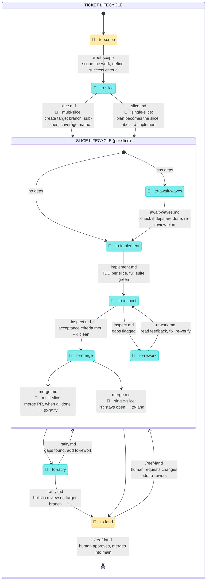

<p align="center">
  
</p>

# Moonjelly Reef

An orchestration framework for AI agent workflows. A short-lived pulse scans for work, dispatches skills, and goes back to sleep. State lives in labels. The reef does the rest.

This framework is **Issue tracker agnostic**. GitHub Issues or simply local MD files. It can also handle others like Jira, ClickUp, Linear, as long as you have an MCP installed for those.

## Install

```sh
npx skills@latest add mesqueeb/moonjelly-reef
```

On first run, reef-pulse will prompt you to mention which issue tracker you want to use.

## 🪼 The moonjelly pulse

> _Through Moonjelly's pulse, the reef is orchestrated, creatures are set in motion, and Moonjelly recedes._

The moonjelly is the orchestrator. A short-lived session (cron or manual) that scans labels, dispatches skills, and exits. It holds no state — labels are the state. Each pulse: scan → dispatch → exit.

## State machine

> 🤿 = human (the diver)
> 🌊 = automated (the reef)



> While slices are being worked, the plan ticket sits in `in-progress`. It is promoted to `to-ratify` by `merge.md` once all slices are done.

## Skills

<details>
<summary>🤿 <b><code>/reef-scope</code></b> — scope an issue</summary>

The single entry point for turning ideas into plans. Determines whether the work is a feature, refactor, or bug, interviews the diver if needed, writes a plan with **success criteria**, and labels `to-slice`.

| source file | [`reef-scope/SKILL.md`](reef-scope/SKILL.md) |
| :---------- | :------------------------------------------- |

</details>

<p align="right">🪼<br /><sub>Moonjelly bumps the diver's mask and points into the dark. Together they scope what lies ahead — the moonjelly illuminates, the diver makes sense of it.</sub></p>

<details>
<summary>🤿 / 🌊 <b><code>/reef-pulse</code></b> — the orchestrator</summary>

Scans all labelled issues, dispatches the appropriate phase for each as a sub-agent, and exits. Holds no state — labels are the state. Run it manually or from cron; the skill handles the same pulse flow either way.

If you've queue'd up enough issues that you've scoped with the `reef-scope` skill, simply calling `reef-pulse` will make the reef start the work, continuously recursively pulsing, taking every ticket through all phases, until the work is done!

Design principles:

- **Testing at source**: each transition includes verification before tagging.
- **Small batches**: slices flow independently and concurrently.
- **Human = bottleneck**: minimize 🤿 states. Only two: scope, land.
- **No heroics**: agents that are stuck flag + move on, never spiral.
- **Make work visible**: the labels ARE the visibility.

| source file | [`reef-pulse/SKILL.md`](reef-pulse/SKILL.md) |
| :---------- | :------------------------------------------- |

</details>

<p align="right">🪼<br /><sub>Through Moonjelly's pulse, the reef is orchestrated, creatures are set in motion, and Moonjelly recedes.</sub></p>

<details>
<summary>🤿 <b><code>/reef-land</code></b> — review and land the work</summary>

Finds the open PR for the issue, summarizes the report, and checks for PR comments. If the diver has concerns or left PR comments, runs an interview to scope the change requests into concrete gaps, then labels `to-rework`. If approved, merges and closes.

| source file | [`reef-land/SKILL.md`](reef-land/SKILL.md) |
| :---------- | :----------------------------------------- |

</details>

<p align="right">🪼<br /><sub>Moonjelly drifts to the diver one last time, the reef's work cradled in its bell. The diver returns to shore with what the reef has made.</sub></p>

## Pulse phase details

These are the 🌊 automated phases dispatched by the `reef-pulse` skill. Each phase reads its instructions from a file under `reef-pulse/`.

<details>
<summary>🌊 <b><code>to-slice</code></b> 🏷️</summary>

Automatically breaks the plan into vertical slices, or determines a single slice is enough to tackle the plan.

- 🔶　single-slice: plan becomes the slice, labels `to-implement`, no target branch.
- 🔷　multi-slice: create target branch, sub-issues, coverage matrix, label slices `to-implement` or `to-await-waves`.

| source file | [`reef-pulse/slice.md`](reef-pulse/slice.md) |
| :---------- | :------------------------------------------- |

</details>

<p align="right">𐃆🐋<br /><sub>A narwhal drives its tusk through the ice ceiling in one clean thrust — the fracture lines radiate outward, each shard a perfect, independent piece.</sub></p>

<details>
<summary>🌊 <b><code>to-await-waves</code></b> 🏷️</summary>

Check if a blocked slice's dependencies are all done. If yes, re-review the plan against current code and label `to-implement`. If not, exit — next pulse will check again.

| source file | [`reef-pulse/await-waves.md`](reef-pulse/await-waves.md) |
| :---------- | :------------------------------------------------------- |

</details>

<p align="right">🪸<br /><sub>A coral polyp sits anchored to the reef, patient and still, filtering the current — when the nutrients arrive, it's already open.</sub></p>

<details>
<summary>🌊 <b><code>to-implement</code></b> 🏷️</summary>

Implement a slice using TDD in a git worktree. Create worktree → read context → red-green-refactor for each acceptance criterion → write report → open PR → label `to-inspect`.

| source file | [`reef-pulse/implement.md`](reef-pulse/implement.md) |
| :---------- | :--------------------------------------------------- |

</details>

<p align="right">🐙<br /><sub>Eight arms working in fierce, silent concert, the octopus reshapes the reef floor — architecting, testing, sealing every chamber with cold intelligence.</sub></p>

<details>
<summary>🌊 <b><code>to-inspect</code></b> 🏷️</summary>

Independently verify a slice PR. Run the full test suite, check each acceptance criterion against actual code, do trivial cleanups. Label `to-merge` if approved, `to-rework` if gaps found.

| source file | [`reef-pulse/inspect.md`](reef-pulse/inspect.md) |
| :---------- | :----------------------------------------------- |

</details>

<p align="right">🧿<br /><sub>A barreleye fish rotates its tubular eyes upward through its transparent skull, scrutinizing every shadow above for anything that doesn't belong.</sub></p>

<details>
<summary>🌊 <b><code>to-rework</code></b> 🏷️</summary>

Fix every issue flagged by the inspector. Address all PR comments, run the full suite, update the report, label `to-inspect` for re-review.

| source file | [`reef-pulse/rework.md`](reef-pulse/rework.md) |
| :---------- | :--------------------------------------------- |

</details>

<p align="right">🦀<br /><sub>A crab molts its old shell — exposed and soft, it reworks itself from the inside out, emerging harder and better-fitted than before.</sub></p>

<details>
<summary>🌊 <b><code>to-merge</code></b> 🏷️</summary>

🔶　single-slice: leave the PR open for the diver, label `to-land`. 🔷　multi-slice: merge the PR into the target branch, verify suite, close the slice, check for newly unblocked siblings, label plan `to-ratify` when all slices are done.

| source file | [`reef-pulse/merge.md`](reef-pulse/merge.md) |
| :---------- | :------------------------------------------- |

</details>

<p align="right">🐢<br /><sub>A sea turtle tucks the last loose piece under its flipper and glides steadily toward shore — unhurried, certain, folding everything into the current behind it.</sub></p>

<details>
<summary>🌊 <b><code>to-ratify</code></b> 🏷️</summary>

🔷　multi-slice only. Holistic review of the entire target branch — checking the composed whole, not the parts. Verify every success criterion end-to-end, run the full suite, produce the aggregate report, label `to-land` or `to-rework` on gaps.

| source file | [`reef-pulse/ratify.md`](reef-pulse/ratify.md) |
| :---------- | :--------------------------------------------- |

</details>

<p align="right">🦭<br /><sub>The walrus hauls itself onto the ice floe, surveys the entire colony with slow, deliberate eyes, and counts every last pup — nothing is declared safe until the old bull has seen it all.</sub></p>

## Phase metrics

Every phase tracks its duration and token usage. Metrics are written exclusively by reef-pulse after each dispatched sub-agent completes — individual phase files do not self-report metrics. Metrics accumulate in a single table on the plan issue (and the plan PR once one exists), giving the reviewer a complete cost/time breakdown from scoping through landing. reef-scope is the only exception: because it runs in the user's session (not as a sub-agent), it records its own wall-clock duration on the plan issue. When all work is done, a bold **Total** row sums durations and tokens across the entire lifecycle.

## Orchestration accuracy

The reason this orchestration framework works is explicit boundaries. Each phase has four well-defined concerns:

1. **Variables** — what each phase needs is declared up front.
2. **Context source** — where each phase reads its input (tracker issue, PR, plan body) is well-defined.
3. **Code persistence** — where code changes get committed and pushed is well-defined.
4. **Progress metadata** — where labels, issue bodies, and PR bodies get updated is well-defined.

[`ORCHESTRATION.md`](ORCHESTRATION.md) is the single source of truth for these four concerns across all phases. It outlines purely the deterministic orchestration boundaries in a holistic view — not the phase logic itself, just the variables, context fetches, commits, PR operations, and tracker updates in their correct order.

[`tests/test-orchestration.sh`](tests/test-orchestration.sh) verifies that each phase's `.md` instructions include these deterministic parts of the orchestration in the correct order. If a phase drifts — missing a variable declaration, reordering a commit and PR create, or dropping a tracker update — the test catches it.

To further ensure no sub-agent messes up worktree creation, branch targeting, or commit flow, all git operations are wrapped in shell scripts (`worktree-enter.sh`, `worktree-exit.sh`, `commit.sh`) with extra sanitisation. Reef keeps its temporary worktrees under `.worktrees/` inside the repo, and target branch names and paths are passed via shell variables so that sub-agents never have to reason about git orchestration themselves.

## Autopilot

Run the reef on autopilot so it pulses while you're away. If you've queue'd up enough issues that you've scoped with the `reef-scope` skill, simply calling `reef-pulse` will make the reef start the work, continuously recursively pulsing, taking every ticket through all phases, until the work is done!

## Remote Machine Cron

You could also set up a remote machine with eg. a Claude Code cron that continuously runs pulses. When a pulse is running already, when the cron pulses, we have a lock to prevent double work.

```sh
CronCreate cron="7 * * * *" prompt="Run the reef-pulse skill." durable=true
```

## Companion skill

<details>
<summary>🛡️ <b><code>git-guardrails-claude-code</code></b></summary>

Blocks dangerous git commands (force push, hard reset, force delete) while allowing safe everyday operations like pushing from worktrees and cleaning up merged branches — exactly what reef agents do all day.

```sh
npx skills@latest add mesqueeb/moonjelly-reef/git-guardrails-claude-code
# Then run it once via
/git-guardrails-claude-code
```

</details>
