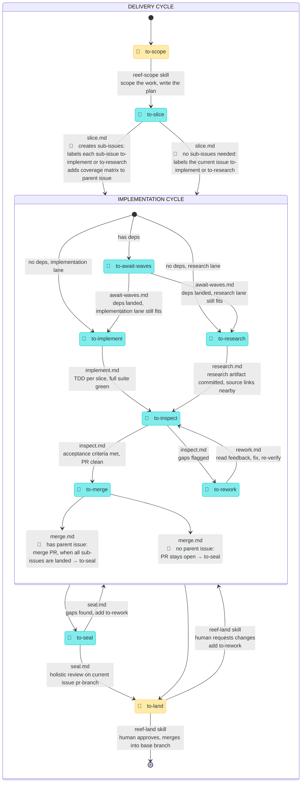

<p align="center">
  
</p>

# Moonjelly Reef

Minimal AI orchestration. Scope a ticket, and the reef handles the rest — splitting, implementing, reviewing, and polishing a PR for you to land.

Prep the work with `/reef-scope`, run `/reef-pulse` before bed, and wake up to polished PRs waiting to land. The reef does its own QA loops, task management, all from a simple skill.

## Motivation

Most orchestration frameworks front-load complexity: dozens of new terms, external databases, and a CLI to install before you can do anything. Moonjelly Reef is just a skill. Drop it in, run `/reef-pulse`, and go to bed. The reef QA-loops until everything is polished, then waits for you to land it.

|                       | 🪼 Moonjelly Reef                                                                  | RUFLO                                                               | GASTOWN                                                         | GSD                                                                              |
| :-------------------- | :--------------------------------------------------------------------------------- | :------------------------------------------------------------------ | :-------------------------------------------------------------- | :------------------------------------------------------------------------------- |
| **Concepts to learn** | Just 3 skills.                                                                     | ~137 skills, 16 agent types, swarm topologies, consensus algorithms | framework-specific terms: beads, polecats, convoys, hooks, rigs | ~86 skills, spec-driven methodology, `.planning/` schema, 5-step sequence        |
| **Install**           | Add 3 skills.<br />(`npx skills add mesqueeb/moonjelly-reef`)                      | npm, ~340 MB, MCP config                                            | Go, Dolt, beads CLI, tmux, sqlite3                              | 86 skill files, gsd-sdk CLI, NodeJS (multi-provider AI runtime, native binaries) |
| **State storage**     | Issue labels<br />(you can choose GitHub, other issue trackers, or local md files) | custom vector DB, SQLite, knowledge graph                           | Dolt DB, beads CLI, git worktrees                               | `.planning/` dir tree — 88 auto-created subdirs                                  |

## Install

```sh
npx skills add mesqueeb/moonjelly-reef
```

Run `/reef-scope` first: it walks you through setup, then asks if you want to scope some work. That's really all you need. `/reef-scope` to scope some work, `/reef-pulse` before going to bed. Try to scope at least a couple of tasks, so you can feel the true might of the reef.

Anything below is more sort of "informative". Nothing you _need_ to know. It's best you dive right in and try it out.

## How it works

### Skills

<details>
<summary>🤿 <b><code>reef-scope</code></b> — scope an issue</summary>

The single entry point for turning ideas into plans. It always starts by asking what kind of work this is — recommending one if an issue is passed in — then writes a plan with User Stories, Implementation Decisions, and Testing Decisions, and labels `to-slice` — or `to-implement` directly for bugs and refactors (which skip slicing).

Five work types to choose from:

- `scope a feature`
- `scope a refactor`
- `triage a bug`
- `I'm feeling lucky (toss it in as-is, see what the reef creates)`
- `deep research`

| source file | [`reef-scope/SKILL.md`](reef-scope/SKILL.md) |
| :---------- | :------------------------------------------- |

</details>

<p align="right">🪼<br /><sub>Moonjelly drifts beside the diver like a hand-lantern in blue water. Together they peer into the dimness until the shape of the work comes gently into view.</sub></p>

<details>
<summary>🤿 / 🌊 <b><code>reef-pulse</code></b> — the orchestrator</summary>

Runs pulse iterations inside one short-lived session: scan labels, route work to the appropriate sub-agent, recurse while automated work remains, then exit. Holds no state — labels are the state. Run it manually or from cron; the skill handles the same pulse flow either way.

If you've queued up enough issues with the `reef-scope` skill, running the `reef-pulse` skill will make the reef start the work, recursively pulsing through all automated phases until no automated work remains.

| source file | [`reef-pulse/SKILL.md`](reef-pulse/SKILL.md) |
| :---------- | :------------------------------------------- |

</details>

<p align="right">🪼<br /><sub>When Moonjelly pulses, the reef wakes softly. Little lights blink on in hidden corners, and each creature knows which bit of the work to carry.</sub></p>

<details>
<summary>🤿 <b><code>reef-land</code></b> — review and land the work</summary>

Finds the open PR for the issue, summarizes the report, and checks for PR comments. If the diver has concerns or left PR comments, runs an interview to scope the change requests into concrete gaps, then labels `to-rework`. If approved, merges and closes.

| source file | [`reef-land/SKILL.md`](reef-land/SKILL.md) |
| :---------- | :----------------------------------------- |

</details>

<p align="right">🪼<br /><sub>At the end of the tide, Moonjelly returns with the reef's work tucked safely beneath its bell. The diver takes it ashore, to relish in what the reef has made.</sub></p>

### State machine

> You only touch two steps (scope and land). The reef handles everything in between.

> 🤿 = human (the diver)
> 🌊 = automated (the reef)



> While sub-issues are being worked, the parent issue sits in `in-progress`. It is promoted to `to-seal` by `merge.md` once all sub-issues are landed.
>
> Each issue has one `DELIVERY CYCLE`. It may contain one or many execution cycles: one on the issue itself when no sub-issues are needed, or one per sub-issue when the work is split. Most slices use the implementation cycle; research slices branch through `to-research` but rejoin the same inspect, rework, merge, and seal flow.

### Pulse phase details

These are the 🌊 automated phases dispatched by the `reef-pulse` skill. Each phase reads its instructions from a file under `reef-pulse/`.

<details>
<summary>🌊 <b><code>to-slice</code></b> 🏷️</summary>

Automatically breaks the plan into vertical slices, or determines that the current issue can be executed directly without sub-issues.

- 🔷　creates sub-issues: labels each sub-issue `to-implement`, `to-research`, or `to-await-waves`, adds coverage matrix to the parent issue
- 🔶　no sub-issues needed: labels the current issue `to-implement` or `to-research`

| source file | [`reef-pulse/slice.md`](reef-pulse/slice.md) |
| :---------- | :------------------------------------------- |

</details>

<p align="right">𐃆🐋<br /><sub>A narwhal drives its tusk through the ice ceiling in one clean thrust — the fracture lines radiate outward, each shard a perfect, independent piece.</sub></p>

<details>
<summary>🌊 <b><code>to-await-waves</code></b> 🏷️</summary>

Check if a blocked issue's dependencies are all landed. If yes, re-review the plan against current code and restore the right execution label: `to-research` for deep-research work, `to-implement` otherwise. If not, exit — next pulse will check again.

| source file | [`reef-pulse/await-waves.md`](reef-pulse/await-waves.md) |
| :---------- | :------------------------------------------------------- |

</details>

<p align="right">🪸<br /><sub>A coral polyp sits anchored to the reef, patient and still, filtering the current — when the nutrients arrive, it's already open.</sub></p>

<details>
<summary>🌊 <b><code>to-implement</code></b> 🏷️</summary>

Implement an issue using TDD in a git worktree. Create worktree → read context → red-green-refactor for each acceptance criterion → write report → open PR → label `to-inspect`.

| source file | [`reef-pulse/implement.md`](reef-pulse/implement.md) |
| :---------- | :--------------------------------------------------- |

</details>

<p align="right">🐙<br /><sub>An octopus in a little workshop arranges shells, pebbles, and ribbons of kelp with patient hands. By dusk, a once-empty corner of the reef has become something useful and alive.</sub></p>

<details>
<summary>🌊 <b><code>to-research</code></b> 🏷️</summary>

Execute a research issue in a git worktree. Investigate the promised question, persist committed Markdown research artifacts, keep lightweight source links close to externally sourced findings, write the report, and label `to-inspect`.

| source file | [`reef-pulse/research.md`](reef-pulse/research.md) |
| :---------- | :------------------------------------------------- |

</details>

<p align="right">🐬<br /><sub>A dolphin loops ahead of the reef and returns with a ribbon of shells, each one pointing back toward what it found in the open water. The trail is playful, but nothing in it is vague.</sub></p>

<details>
<summary>🌊 <b><code>to-inspect</code></b> 🏷️</summary>

Independently verify an issue's PR. Run the full test suite, check each acceptance criterion against actual code, do trivial cleanups. Label `to-merge` if approved, `to-rework` if gaps found.

| source file | [`reef-pulse/inspect.md`](reef-pulse/inspect.md) |
| :---------- | :----------------------------------------------- |

</details>

<p align="right">🧿<br /><sub>The barreleye hovers like a tiny lantern with watchful eyes, turning this way and that until even the smallest crooked shadow has nowhere left to hide.</sub></p>

<details>
<summary>🌊 <b><code>to-rework</code></b> 🏷️</summary>

Fix every issue flagged by the inspector. Address all PR comments, run the full suite, update the report, label `to-inspect` for re-review.

| source file | [`reef-pulse/rework.md`](reef-pulse/rework.md) |
| :---------- | :--------------------------------------------- |

</details>

<p align="right">🦀<br /><sub>A crab drags home a shell that pinches in all the wrong places, then spends the afternoon nudging, sanding, and trying again. By evening it has made a snugger little house and walks more easily in it.</sub></p>

<details>
<summary>🌊 <b><code>to-merge</code></b> 🏷️</summary>

🔶　no parent issue: leave the PR open, verify suite, and label the issue `to-seal`. 🔷　has parent issue: merge the PR into the parent issue's `pr-branch`, verify suite, close the sub-issue, and label the parent issue `to-seal` when all sub-issues are landed.

| source file | [`reef-pulse/merge.md`](reef-pulse/merge.md) |
| :---------- | :------------------------------------------- |

</details>

<p align="right">🐢<br /><sub>A sea turtle gathers the stragglers beneath her flipper and takes the long safe route home. What was scattered across the reef arrives together at the same quiet shore.</sub></p>

<details>
<summary>🌊 <b><code>to-seal</code></b> 🏷️</summary>

Holistic review of the current issue's `pr-branch` — checking the composed whole, not the parts. Verifies that the issue is actually solved end-to-end, runs the full suite, produces the aggregate report. Label `to-land` on pass, `to-rework` if fixable gaps found, or `to-land` + `blocked-need-human-input` if a decision beyond the plan is needed.

| source file | [`reef-pulse/seal.md`](reef-pulse/seal.md) |
| :---------- | :----------------------------------------- |

</details>

<p align="right">🦭<br /><sub>An elephant seal heaves up beside the finished work and presses his warm weight along every seam. He listens, waits, and listens again. Only when the whole thing holds together does he let it drift on.</sub></p>

### Phase metrics

reef-pulse writes a running metrics table to the plan issue after each phase completes, giving a full cost and time breakdown from scope to land. Once the issue is landed, a bold **Total** row is added.

_Example:_

| Phase       | Target | Duration | Tokens  | Tool uses | Outcome                                | Date             |
| ----------- | ------ | -------- | ------- | --------- | -------------------------------------- | ---------------- |
| await-waves | #191   | 1m39s    | 43,050  | 24        | unblocked, ready for implementation    | 2026/04/24 19:07 |
| implement   | #191   | 13m09s   | 125,782 | 128       | implementation complete                | 2026/04/24 19:21 |
| inspect     | #191   | 2m57s    | 54,399  | 37        | PASS — 8 criteria met, 476 tests green | 2026/04/24 19:30 |
| merge       | #191   | 1m38s    | 20,983  | 16        | merged into parent pr-branch           | 2026/04/24 19:32 |

> **Claude Code only.** Codex cannot retrieve token counts or durations from dispatched sub-agents, so metrics will be limited when running the reef on Codex.

### Autopilot

Run the reef on autopilot so it pulses while you're away. If you've queued up enough issues with the `reef-scope` skill, running the `reef-pulse` skill will keep the reef pulsing recursively until no automated work remains.

**Remote Machine Cron**

You could also set up a remote machine with eg. a Claude Code cron that continuously runs pulses. When a pulse is running already, when the cron pulses, we have a lock to prevent double work.

For example in Claude Code you can do something like:

```sh
CronCreate cron="7 * * * *" prompt="Run the reef-pulse skill." durable=true
```

Then if you scope new issues on your main machine, the remote machine will be picked up by the reef at least once an hour.

### Orchestration accuracy

Every phase has explicit, tested boundaries. [`ORCHESTRATION.md`](ORCHESTRATION.md) is the single source of truth — it declares the variables, context sources, code persistence, and tracker updates for every phase in the correct order. [`tests/orchestration.test.sh`](tests/orchestration.test.sh) verifies that each phase file follows that contract; if a phase drifts, the test catches it.

All git operations run through shell scripts (`worktree-enter.sh`, `worktree-exit.sh`, `commit-push.sh`, `push.sh`, `fetch.sh`, `merge.sh`) so sub-agents never have to reason about git orchestration themselves.

**Tracker and git contracts**

Every reef phase calls the same shell scripts for git work and `tracker.sh` / `merge.sh` for metadata. Tracker translation is a single global rule:

- For `local-tracker`, run `./tracker.sh` and `./merge.sh` exactly as written.
- For GitHub, replace `./tracker.sh` and `./merge.sh` with `gh`.
- For other trackers with MCP issue tools, replace `./tracker.sh issue` with their MCP equivalent and `./tracker.sh pr` / `./merge.sh pr` with `gh pr`.

#### Tracker operations

Tracker type (chosen at setup) determines what handles issues and PRs — `local-tracker` keeps everything on disk, while `github` and `clickup` delegate to their respective APIs.

| Operation                                               | `local-tracker`                                                                                                           | `github`                                                                        | `clickup`                                                                                             |
| :------------------------------------------------------ | :------------------------------------------------------------------------------------------------------------------------ | :------------------------------------------------------------------------------ | :---------------------------------------------------------------------------------------------------- |
| `tracker.sh issue` create / view / edit / close / list  | reads and writes `[label] plan.md` or `[label] slice.md` files on disk. Labels are `[label]` filename prefixes.           | becomes `gh issue` — issue body + labels via GitHub API.                        | becomes ClickUp MCP tools — task body + status/tags. Issues live in ClickUp; code still lives in git. |
| `tracker.sh pr` create / view / edit                    | reads and writes `[label] progress.md` files on disk. Labels are `[label]` filename prefixes, mirroring plan/slice files. | becomes `gh pr` — PR body + labels via GitHub API.                              | becomes `gh pr` — same as GitHub. ClickUp has no PR concept; PRs live in the git host.                |
| `tracker.sh pr view` with `--web` to open PR in browser | opens `progress.md` in the default app (`xdg-open` on Linux, `open` on macOS).                                            | becomes `gh pr view` — Opens the GitHub PR URL in the browser.                  | becomes `gh pr view` — Same as GitHub.                                                                |
| `gh api graphql` for PR review threads                  | not fetched — Simply call `reef-land` to discuss with the agent directly.                                                 | `gh api graphql` — fetches live review threads and inline comments from GitHub. | `gh api graphql` — same as GitHub (PR lives in git host).                                             |

#### Git operations

Remote presence determines how git scripts behave — scripts auto-detect whether `origin` is configured and skip remote ops when absent.

| Operation           | no remote origin                                                                                                           | with remote origin                                                                                                          |
| :------------------ | :------------------------------------------------------------------------------------------------------------------------- | :-------------------------------------------------------------------------------------------------------------------------- |
| `commit-push.sh`    | Stage all, commit, advances local branch ref.                                                                              | Stage all, commit, push to `origin/branch`.                                                                                 |
| `worktree-enter.sh` | Create worktree from local `fork-from`. If fork-from ≠ pull-latest, merge pull-latest (push skipped).                      | Fetch, create detached-HEAD worktree from `origin/fork-from`. If fork-from ≠ pull-latest, merge pull-latest and push clean. |
| `worktree-exit.sh`  | Remove worktree locally. Fails if uncommitted or untracked.                                                                | same                                                                                                                        |
| `merge.sh pr merge` | Local git merge. Reads base branch from `progress.md`. (For `github` / `clickup` trackers: becomes `gh pr merge` instead.) | same                                                                                                                        |

#### Track progress in local md files

At setup you can choose to use local md files to track your issues, plans and progress (rather than GitHub or others). When you do so, you are asked whether you want those md files git-committed or git-ignored. If git-committed, the Setup Guard in every skill ensures `tracker-branch` is checked out before any work begins. `tracker.sh` always resolves reads and writes to that main working tree — even when called from a PR-branch worktree — by detecting its location via `git rev-parse --git-common-dir`. After each write, it commits and pushes directly on `tracker-branch`.

## Companion skill

<details>
<summary>🛡️ <b><code>git-guardrails-claude-code</code></b></summary>

Blocks dangerous git commands (force push, hard reset, force delete) while allowing safe everyday operations like pushing from worktrees and cleaning up merged branches — exactly what reef agents do all day.

```sh
npx skills@latest add mesqueeb/moonjelly-reef/git-guardrails-claude-code
# Then run it once via
/git-guardrails-claude-code
```

</details>
