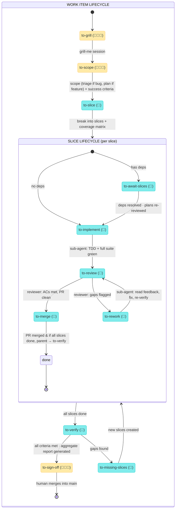

# Orchestration State Machine

**Issue tracker** = GitHub Issues, Jira, ClickUp, Linear, or any kanban board. The doc says "issue tracker" everywhere — substitute yours.

## The orchestrator loop

The orchestrator is a short-lived session (cron or manual invocation). Each run:

```
1. Scan all items by tag (issue tracker or local md files).

2. Dispatch all 🤖 work as sub-agents (in parallel):
   ├─ to-slice            → sub-agent: break into slices, verify coverage
   ├─ to-await-slices     → check if deps are done; if yes, re-review plan & tag to-implement
   ├─ to-implement        → sub-agent: TDD per unblocked slice
   ├─ to-rework           → sub-agent: read review feedback, fix
   ├─ to-review           → sub-agent: review the PR
   ├─ to-merge            → sub-agent: merge PR, check for newly unblocked slices
   ├─ to-verify           → sub-agent: holistic review on feature branch
   └─ to-missing-slices   → sub-agent: analyze gaps, create new slices

   Parallel slices within the same parent may be dispatched as an agent team
   (shared task list, self-claim, direct messaging) when beneficial.

   Each sub-agent tags its own work when done (next phase tag).

3. While sub-agents run, present 👨🏽‍🦳 items to the human (if manual invocation):
   ├─ to-sign-off  → "This item has a report ready. Review?"
   ├─ to-scope     → "This item is ready to scope. Start?"
   └─ to-grill     → "This item needs grilling. Start?"

4. Exit when nothing is actionable.
```

When running as a cron: wake → run loop → sleep.
When running manually: human invokes → loop dispatches 🤖 and presents 👨🏽‍🦳 items → repeat until nothing actionable.

State lives in tags (issue tracker labels or filename prefixes), not in session memory. Sub-agents read tags, do their work, and set the next tag. The orchestrator itself holds no state — it just scans and dispatches.

Design principles (via DevOps):

- **Testing at source**: each transition includes verification before tagging. No separate "testing" states.
- **Small batches**: slices flow through the pipeline independently and concurrently. The loop doesn't wait for all slices to reach the same state.
- **Human = bottleneck**: minimize 👨🏽‍🦳 states. Only three: grill, scope, sign-off.
- **No heroics**: agents that are stuck flag + move on, never spiral.
- **Make work visible**: the tags ARE the visibility. Scan tags = see the whole board.

## State machine



## Phase details

<details>
<summary><code>to-grill</code> · 👨🏽‍🦳</summary>

Orchestrator presents item to human. Human runs grill-me session.

| Produces      |                                                                               |
| ------------- | ----------------------------------------------------------------------------- |
| Issue tracker | Grill-me session appended to issue body. Tag with `to-scope`.                 |
| Local files   | `feature-x/grill-me-session.md` (includes original idea text + full session). |

</details>

<details>
<summary><code>to-scope</code> · 👨🏽‍🦳</summary>

Orchestrator presents item to human. Human scopes the work — determines whether this is a feature, refactor, or bug, and picks the appropriate approach.

The scoping phase is responsible for:

- Consuming the grill-me session
- Grilling on success criteria if not already covered
- Producing testable success criteria (what does "done" look like from the consumer's perspective?)
- For refactors: enforcing always-compiles, always-green, tiny-commit discipline in the plan
- For bugs: assessing scope (quick fix → single slice, elaborate → full plan)

| Produces      |                                                                                                                 |
| ------------- | --------------------------------------------------------------------------------------------------------------- |
| Issue tracker | Plan with **success criteria** section, appended or as new linked issue. Tag with `to-slice`. |
| Local files   | `feature-x/plan.md` — with success criteria.                                                  |

</details>

<details>
<summary><code>to-slice</code> · 🤖</summary>

Orchestrator breaks the plan into slices automatically. Every success criterion must be covered by ≥1 slice AC. If gaps: revise slices until covered. No 👨🏽‍🦳 needed.

This phase also creates the **feature branch** (branched from main or the configured base). All slice PRs will target this feature branch. The feature branch is what eventually gets merged into main at sign-off.

For small bugs (scope = quick fix): produces a single slice. No coverage matrix needed — the triage issue's ACs are the slice's ACs.

Slices with no dependencies are tagged `to-implement`. Slices that depend on other slices are tagged `to-await-slices`.

| Produces      |                                                                                                                                                                  |
| ------------- | ---------------------------------------------------------------------------------------------------------------------------------------------------------------- |
| Issue tracker | Sub-issues with ACs + dependency graph + **coverage matrix** (criterion → issue → AC). Feature branch created. Each sub-issue tagged `to-implement` or `to-await-slices`. |
| Local files   | `feature-x/slices/001-slice-name.md`, `feature-x/coverage-matrix.md`. Feature branch created.                                                                    |

</details>

<details>
<summary><code>to-await-slices</code> · 🤖</summary>

Orchestrator checks whether this slice's dependencies have all been merged.

```
1. Fetch latest remote.
2. Check: are all dependency slices tagged "done" with PRs merged?
   - If no → exit. This slice stays to-await-slices until next loop.
   - If yes → continue.
3. Re-review this slice's plan against the current state of the feature branch.
   Earlier slices may have changed the codebase in ways that affect this slice's
   approach (new interfaces, renamed modules, shifted boundaries).
4. If the plan still holds → tag to-implement.
5. If adjustments needed → update the slice's ACs/description to reflect
   the current reality, then tag to-implement.
```

| Produces      |                                                                                                 |
| ------------- | ----------------------------------------------------------------------------------------------- |
| Issue tracker | Slice tagged `to-implement` (possibly with updated ACs). Or no change if deps aren't done yet.  |
| Local files   | Slice md file updated if needed. Or no change.                                                  |

</details>

<details>
<summary><code>to-implement</code> · 🤖</summary>

Orchestrator dispatches a sub-agent (in a worktree).

Sub-agent checklist (non-negotiable contract):

```
1. GIT PREP
   □ Create worktree from {base-commit} on branch {slice-branch}
   □ Verify remote is pulled
   □ Verify base branch has all previously merged slices
   □ Verify no unrelated commits present

2. READ CONTEXT
   □ This slice's ACs (the checklist to satisfy)
   □ Parent PRD + success criteria (the "why")
   □ Sibling slices (awareness of what others are doing / have done)
   □ grill-me-session.md (the original decisions)

3. TDD LOOP
   □ For each AC: write test → implement → verify
   □ Full project test suite must be green (not a subset)
   □ If stuck: make best judgment, document the choice, continue
   □ Never silently skip an AC

4. REPORT (in PR description)
   □ ACs checklist: each one done ✓ or not ✗ with explanation
   □ Ambiguous choices: what was decided, why, how it differs from ACs
   □ Test results: full suite output
   □ Any drift from success criteria
```

| Produces      |                                                                                                   |
| ------------- | ------------------------------------------------------------------------------------------------- |
| Issue tracker | PR targeting feature branch. PR description follows report template above. Tag slice `to-review`. |
| Local files   | same (PR is always git-based).                                                                    |

</details>

<details>
<summary><code>to-review</code> · 🤖</summary>

Orchestrator dispatches a reviewer sub-agent.

```
1. Pull latest remote. Checkout PR branch.
2. Run full test suite.
3. Check each AC against the code (not trusting the sub-agent's self-report).
4. Read the "ambiguous choices" section — flag anything that drifted too far.
5. Trivial cleanups: do them (dead code, stale comments, formatting).
6. Substantive gaps: document in review.
```

| Produces    |                                                                     |
| ----------- | ------------------------------------------------------------------- |
| All ACs met | Tag slice `to-merge`.                                               |
| Gaps found  | Tag slice `to-rework` with specific feedback in PR review comments. |

</details>

<details>
<summary><code>to-rework</code> · 🤖</summary>

Orchestrator dispatches a new sub-agent to the same worktree/PR.

```
1. Read the review feedback (PR comments).
2. Read the original ACs + any new ACs from reviewer.
3. Fix the flagged items.
4. Run full suite.
5. Update PR description with revised report.
```

| Produces      |                                               |
| ------------- | --------------------------------------------- |
| Issue tracker | Updated PR with fixes. Tag slice `to-review`. |
| Local files   | same.                                         |

</details>

<details>
<summary><code>to-merge</code> · 🤖</summary>

Orchestrator merges the PR to feature branch.

```
1. Verify feature branch is up to date with remote.
2. Merge PR (squash or regular per project convention).
3. Verify full suite still green after merge.
4. Close the slice issue. Tag slice "done".
5. Check: did this unblock any sibling slices?
   If yes → tag those siblings to-await-slices (so next loop re-reviews and promotes them).
6. If all slices are now done → tag parent work item as to-verify.
```

| Produces      |                                                                          |
| ------------- | ------------------------------------------------------------------------ |
| Issue tracker | Merged PR. Slice tagged `done`. Parent → `to-verify` if all slices done. |
| Local files   | same.                                                                    |

</details>

<details>
<summary><code>to-verify</code> · 🤖</summary>

Orchestrator runs holistic review after all slices merged to feature branch.

```
1. Pull latest remote.
2. Check every success criterion against the actual code holistically (not per-slice).
3. Run full test suite.
4. If all criteria met → generate aggregate report → tag parent to-sign-off.
5. If gaps → tag parent to-missing-slices.
```

The aggregate report contains:

- Success criteria: all met ✓/✗
- Coverage matrix: final status
- All ambiguous LLM decisions (aggregated from every sub-agent's PR)
- Any drift from original grill-me session
- Ticket lifecycle: all closed cleanly?

| Produces             |                                                                        |
| -------------------- | ---------------------------------------------------------------------- |
| Issue tracker (pass) | Aggregate report as comment on parent issue. Tag parent `to-sign-off`. |
| Issue tracker (gaps) | Tag parent `to-missing-slices`.                                        |
| Local files (pass)   | `feature-x/report.md`. Tag parent `to-sign-off`.                       |
| Local files (gaps)   | Tag parent `to-missing-slices`.                                        |

</details>

<details>
<summary><code>to-missing-slices</code> · 🤖</summary>

Orchestrator analyzes gaps, creates new slices for remaining work. No 👨🏽‍🦳 — if the gaps need decisions that aren't in the success criteria, that's a failure of the planning phase (the whole point is that success criteria are complete enough to be self-service).

If the gap is "the agent chose to skip something" (pain point C1), the new slice's ACs explicitly call out what was skipped and why it matters.

Updates the **coverage matrix** to include the new slices — every gap that triggered this phase must now map to an AC on a new slice.

| Produces      |                                                                                                                                                                             |
| ------------- | --------------------------------------------------------------------------------------------------------------------------------------------------------------------------- |
| Issue tracker | New sub-issues linked to parent with ACs for remaining work. Closes partial originals with reference to new issues. Tag new slices `to-implement` or `to-await-slices`. Updated coverage matrix. |
| Local files   | New slice files in `feature-x/slices/`. Updated `feature-x/coverage-matrix.md`.                                                                                              |

</details>

<details>
<summary><code>to-sign-off</code> · 👨🏽‍🦳</summary>

Human reviews the aggregate report. Merges feature branch into main or requests changes.

If changes needed → back to `to-grill` (new decisions needed) or `to-missing-slices` (ACs are clear, just not done).

</details>
